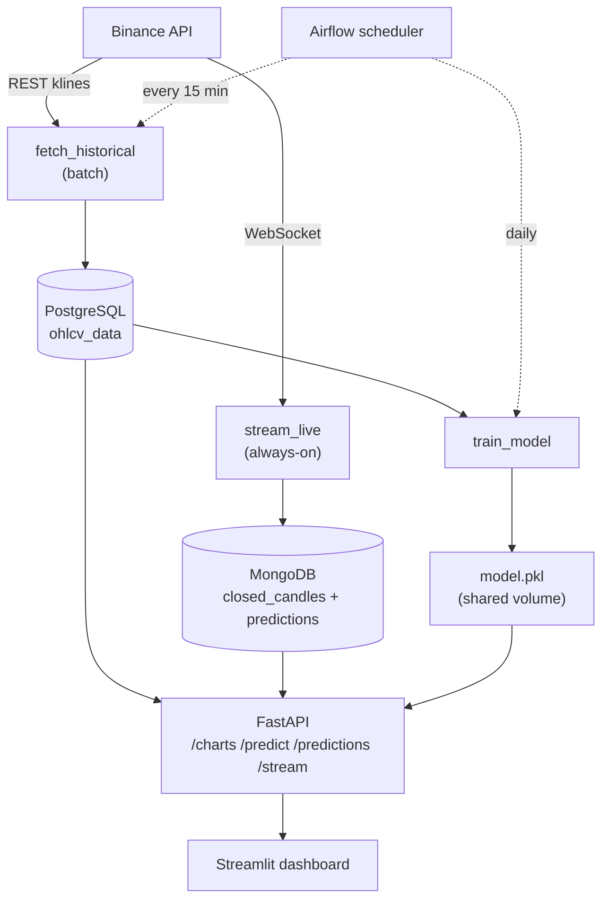
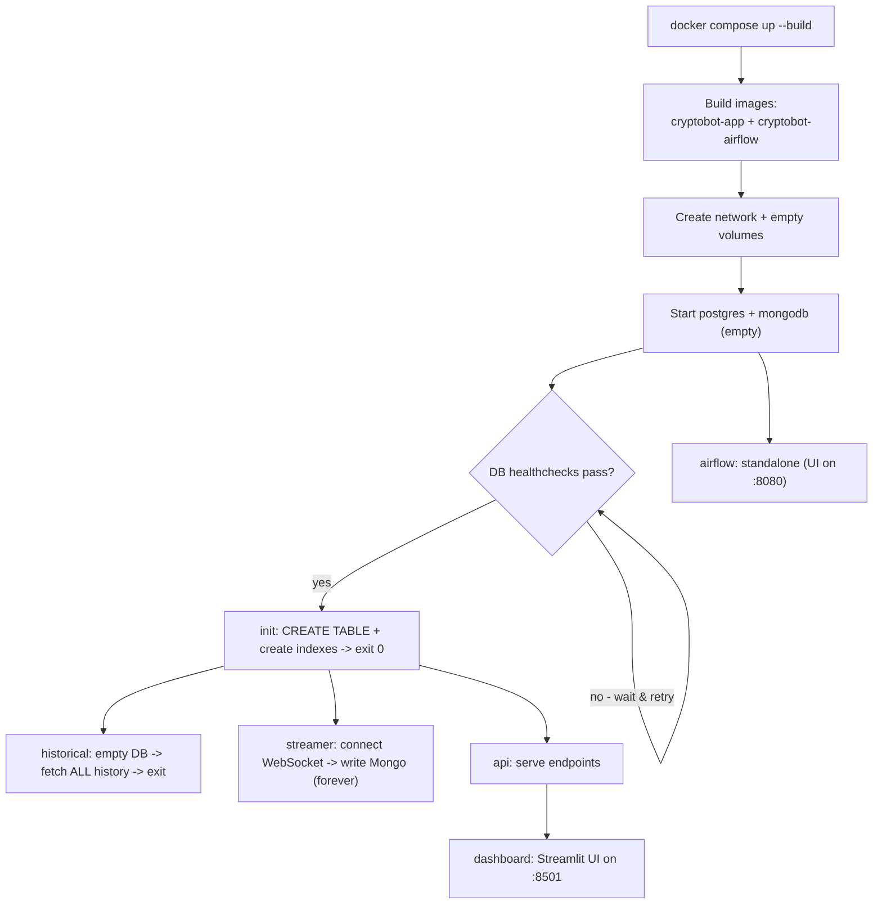
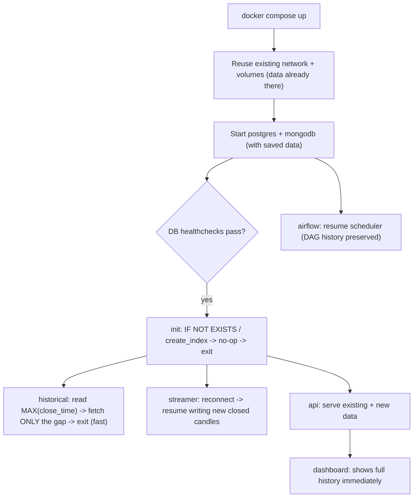
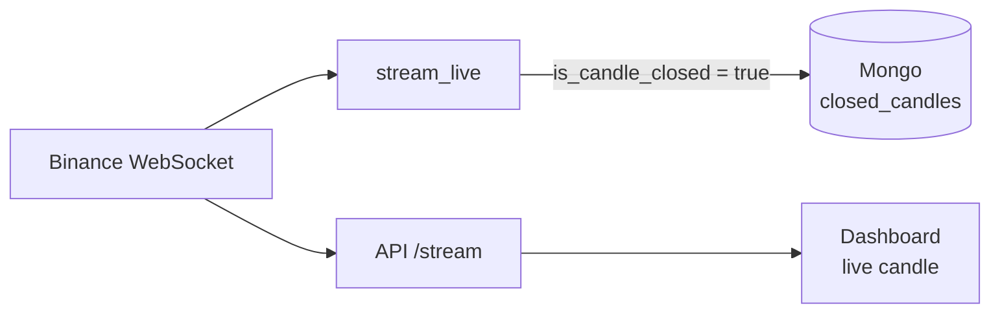
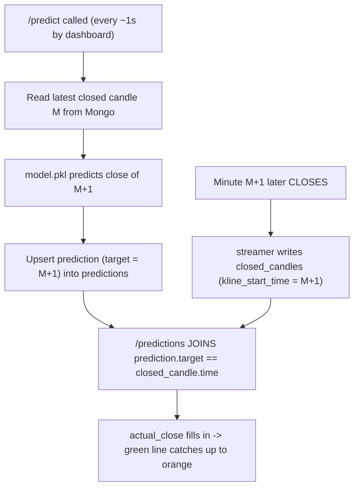
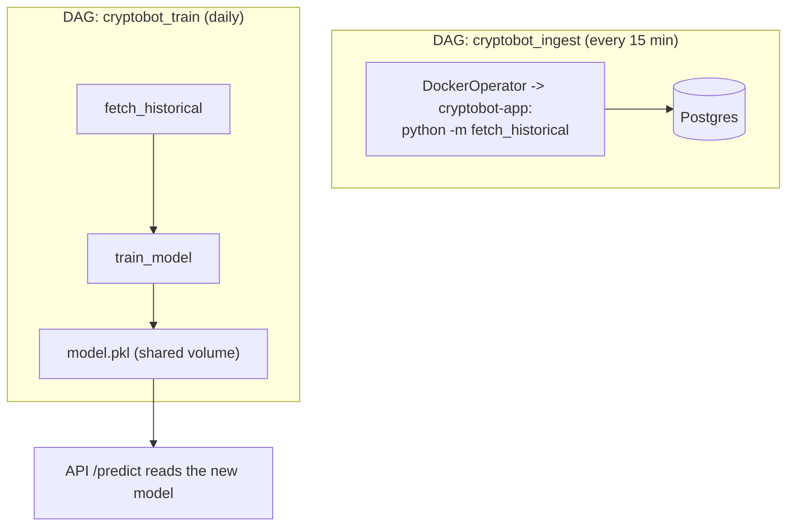
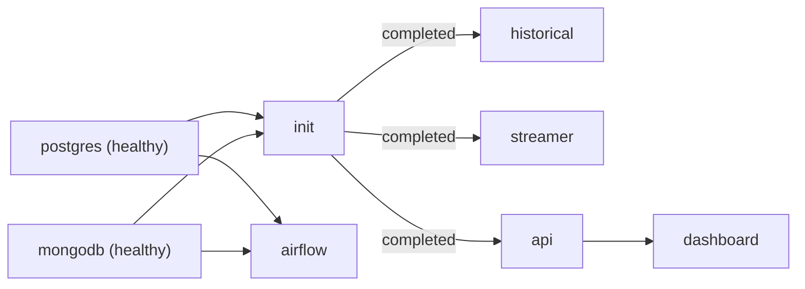

# CryptoBot — Complete Application Flow

This document explains, step by step, **what happens when you run the whole
system** — both the **first time from scratch** and **every later run**.

> **How to view the diagrams:** the flowcharts below are written in **Mermaid**.
> They render automatically on **GitHub**. In **VS Code**, install the extension
> *“Markdown Preview Mermaid Support”* and open the Markdown preview (`Ctrl+Shift+V`).
> Even without rendering, every diagram is followed by a plain numbered explanation.

---

## 1. The components at a glance

| Component | Type | Job |
|---|---|---|
| **postgres** | always-on | Stores historical candles (`ohlcv_data`) — the **training** data |
| **mongodb** | always-on | Stores live closed candles (`closed_candles`) + forecasts (`predictions`) |
| **init** | one-shot | Creates the Postgres table + Mongo indexes, then exits |
| **historical** | one-shot | Backfills / catches up historical candles into Postgres, then exits |
| **streamer** | always-on | Live Binance WebSocket → writes closed candles to Mongo |
| **api** | always-on | FastAPI: `/charts`, `/predict`, `/predictions`, `/stream`, `/health` |
| **dashboard** | always-on | Streamlit UI (reads everything from the API) |
| **airflow** | always-on | Schedules the batch jobs (orchestration) |
| **model.pkl** | shared file | The trained model, on a shared volume (`train_model` writes, `api` reads) |



---

## 2. Where the data lives

| Store | Filled by | Read by | Notes |
|---|---|---|---|
| **PostgreSQL `ohlcv_data`** | `fetch_historical` (REST) | `/charts`, `train_model` | Training source; fixed schema |
| **MongoDB `closed_candles`** | `streamer` (WebSocket) | `/predict`, `/predictions` | Freshest closed candles |
| **MongoDB `predictions`** | `/predict` (each call) | `/predictions` | One forecast per target candle |
| **`model.pkl`** (volume) | `train_model` | `/predict` | Shared between Airflow + API |

---

## 3. ❄️ COLD START — first run, from scratch (empty volumes)

Command:

```bash
docker compose up --build
```



**Step by step:**

1. **Build images.** Docker builds `cryptobot-app` (your code + runtime deps) and
   `cryptobot-airflow` (Airflow + Docker provider). Slow the first time.
2. **Create network + volumes.** `cryptobot_network`, and the empty volumes
   `postgres_data`, `mongo_data`, `cryptobot_models`, `airflow_data`.
3. **Start databases.** `postgres` and `mongodb` boot with **no data**.
4. **Wait for health.** Compose holds dependent services until `pg_isready` and
   Mongo `ping` succeed (the `condition: service_healthy` gates).
5. **`init` runs** (once healthy): creates the `ohlcv_data` table from `schema.sql`,
   and the unique indexes on `closed_candles` and `predictions`. Then **exits 0**.
6. **`historical` runs** (after init): reads `MAX(close_time)` from Postgres →
   **empty** → starts from `HISTORICAL_START_DATE` (Jan 1 2026) → paginates the
   Binance REST API (1000 candles/page) → saves to Postgres. This is the **long**
   one on a cold start (hundreds of thousands of candles). Then **exits**.
7. **`streamer` starts** (after init): opens the Binance WebSocket. Every time a
   1-minute candle **closes**, it upserts that candle into `closed_candles`.
   Runs forever (now with auto-reconnect).
8. **`api` starts** (after init): serves `/charts` (Postgres), `/predict` +
   `/predictions` (Mongo + model), `/stream` (live relay).
9. **`dashboard` starts** (after api): the Streamlit UI. Historical candles show
   immediately; the **live** candle and **prediction** appear within ~1–2 minutes
   (once the streamer has written the first closed candle to Mongo).
10. **`airflow` starts**: initializes its own SQLite metadata DB and launches the
    scheduler + UI. The two DAGs appear **paused** until you enable them.

> **Cold-start gotcha:** `/predict` returns *“unavailable”* until the streamer has
> saved at least one closed candle to Mongo (≈ 1 minute). That’s expected.

---

## 4. ♻️ WARM START — running again after some time (volumes kept)

Command (same one):

```bash
docker compose up        # add --build only if code changed
```



**What’s different from a cold start:**

1. **No data loss.** `postgres_data` / `mongo_data` volumes still hold everything,
   so the databases come up **already populated**.
2. **`init` is a no-op.** `CREATE TABLE IF NOT EXISTS` and `create_index` are
   idempotent — they do nothing because the table/indexes already exist.
3. **`historical` is fast & incremental.** It reads `MAX(close_time)`, resumes
   **1 ms after the last stored candle**, and fetches **only the new candles**
   since the last run. Duplicates are impossible (`ON CONFLICT DO NOTHING`).
   → *This is what closes the “stale data gap” automatically.*
4. **`streamer` resumes.** It reconnects and continues writing new closed candles.
   (Candles that closed **while it was down** are not in Mongo — a known gap;
   auto-reconnect just keeps that window small.)
5. **`model.pkl` is already present** in the shared volume, so `/predict` works
   right away.
6. **Airflow keeps its history** (run logs, DAG on/off state) thanks to
   `airflow_data`.

---

## 5. Continuous runtime flows (always happening once up)

### 5a. Live streaming pipeline (every second)



- The **streamer** persists a candle to Mongo **only when it closes**.
- The **dashboard** gets *every* tick live via the API’s `/stream` relay (a
  separate Binance connection) — that’s the candle forming in real time.

### 5b. Prediction lifecycle — how predicted-vs-actual is built



1. `/predict` reads the **latest closed candle (M)**, forecasts **M+1’s close**,
   and **upserts** a prediction keyed on the target candle (so one row per candle).
2. Later, when **M+1 actually closes**, the streamer writes it to `closed_candles`.
3. `/predictions` **joins** each prediction to the matching actual candle → the
   dashboard shows predicted (orange) vs actual (green); the newest points have no
   actual yet (their candle hasn’t closed).

### 5c. Airflow scheduled automation



- **`cryptobot_ingest`** keeps Postgres fresh every 15 minutes.
- **`cryptobot_train`** catches data up, then retrains the model daily. The new
  `model.pkl` lands on the shared volume → the API serves it on the next
  `/predict` (no restart needed).

---

## 6. Endpoint reference (what each one reads)

| Endpoint | Reads from | Used by |
|---|---|---|
| `GET /health` | — | dashboard health gate |
| `GET /charts` | PostgreSQL `ohlcv_data` | dashboard historical candles |
| `GET /predict` | Mongo `closed_candles` + `model.pkl` → writes `predictions` | dashboard metric + forecast marker |
| `GET /predictions` | Mongo `predictions` ⋈ `closed_candles` | dashboard predicted-vs-actual chart |
| `WS /stream` | Binance WebSocket (relay) | dashboard live candle |

---

## 7. Startup dependency order (who waits for whom)



---

## 8. Command cheat-sheet

```bash
docker compose up --build        # first run / after code changes
docker compose up -d             # later runs, in the background
docker compose logs -f api       # follow one service's logs
docker compose down              # stop everything (KEEPS data volumes)
docker compose down -v           # stop AND wipe volumes -> next run is a COLD start
```

| URL | What |
|---|---|
| http://localhost:8501 | Streamlit dashboard |
| http://localhost:8000/docs | FastAPI docs |
| http://localhost:8080 | Airflow UI |
